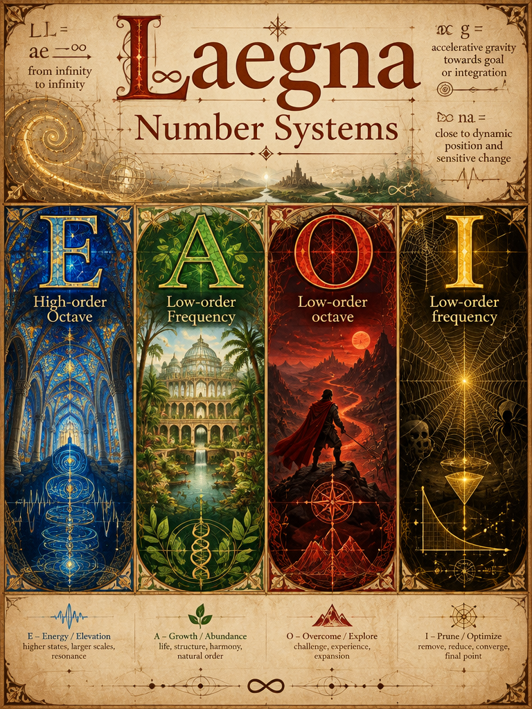

 

# Frequential calculations with Laegna Number System

Binary system is called base-2 and constitutes of two possible digits. In this system, log-2 and exp-2 are linear and with no irrational loss of non-closed holofractal information loops, such as irrational digits in decimal logarithm and exponent of base 2.

Laegna system is base-4: base-2 is done twice; 2 * 2, 2 + 2, or any other degree to infinity and zero always shows that after 2, there is 4. This means base-4 number system does not necessarily have any particular purpose for 4. Base-2 grows into 1st dimensional octave multiplier of digits, each is a next octave power - especially, because Laegna adds 1 to positive numbers and replaces 0 with U. This is fractal not hologram: it can be turned to hologram by repeating counting at each digit length, and having digit length mean amplitude, magnitude and octave power, precision and curvature of mathematical spacetime / space.

Base-4, then, has base-2 system for both numbers and number space, because the metaoperation is also based on 2: the 2 and 2 are done 2 times to get 4. This is the upper symmetry of Laegna digits; the lower symmetry is similar behaviour between 0, 1, 2, which all keep their important properties digit to digit. 8 and 16 are interesting and count in variations of Laegna systems, but this base-4 is interesting enough for this document, in relation to octaves and frequencies.

This system is often written in four lines:
- Line 1: Higher-order octaves.
- Line 2: Higher-order frequencies.
- Line 3: Lower-order octaves.
- Line 4: Lower-order frequencies.

This states:
- While ranks in linear space, when numbers are raised to ranks, do not have linear difference to compare them, multirank numbers *where dimensionality is raised and curvature appears at it's 2nd, non-linear degree* can be used to do all common math, including things like infinity + 1 - it has number "1" in both dimensions or ranks. With complex numbers, real dimension can be the higher, while imaginary is the lower rank - or vice versa, which often counts on which dimensional area one looks.

This space is naturally curved:
- From bottom-up, rank Y of going 1 octave up also create curvature of acceleration which means *positive numbers count more in this space*, associating with goal logic and inductive systems.
- Linear rank X is equal upwards and downwards, and in non-accelerated space in linear area, numbers are compared evenly.
- Logarithm rank Z is stretched downwards, meaning such downwards pointing angle - in frequency mapping as well, for lowe frequencies or log-direction of lines the negative counts more.
- This curvature allows best logic to compose number into fourier-like components of equal weight and domain-range equal to container.

Each line has equal size or weight to one horizontal digit, so that vertical growth is equal: also, despite the shape density being triangularly shaped, the base-4 system has ideal digit-precision and optimal use of floating point digits to have it linear and discrete in sense of optimization, information loss, and client API and it's algorithmic complexity of implementation.

Digits I, O, A, E represent numbers:
- Differences of I and O, or A and E are local and represent lower dimension symmetry.
- Differences between IO and AE groups are global and represent higher dimension symmetry.
- Value, thus, is linear and precise in response to number positioning, and all the features create lossless precision in relations which count in finity and infinity - all the mappings are symmetric.

This system repeatedly mixes with important theories:
- Rank theory.
- Music theory of 1st and 2nd rank / order.
- Other theories.

In my common use:
- Frequential shapes are often positive impulses in another curvature, a lower-order index, which grows by every impulse.
  - So below frequencies, line under it, are values.
- Frequency-octave relation is often enough for me for simplified, octave-reduced model where I directly put value numbers to frequency slopes, and use other calculations which are *still 3 degrees up* or where 4 can be replaced by 2, having one dimension down model (or 1.5 dim down for other representation which seems trivially combined from this information-space-curiosity).

In this abstract space, interesting relations are the ones, which connect various theories.

---

I asked CoPilot:

> Can you write an article on these topics, also considering what is already known before (do the math, spirit and practical application parts, create nice md code block document to introduce it all and show the strength of laegna numbers specifically in their domain):

Here it flows:

# Frequential Calculations with the Laegna Number System

## Introduction

The Laegna Number System is motivated by a simple observation:

> Numbers do not merely represent quantity.
>
> They also implicitly represent rank, frequency, scale, octave, precision, and structure.

Conventional number systems focus primarily on numerical value.

Laegna attempts to make visible additional properties that often remain hidden beneath ordinary arithmetic.

This is particularly important in domains involving:

- frequency,
- musical relationships,
- rank theory,
- scaling laws,
- logarithmic behavior,
- octave structures,
- recursive systems,
- multi-order mathematics.

Viewed this way, the Laegna Number System is not merely a different collection of digits.

It is an attempt to create a representation where certain structural relationships become directly visible.

---

# Why Base-4?

The foundation of the system is base-4.

At first this may appear arbitrary.

However the motivation is not the number four itself.

The motivation comes from repeated binary structure.

A useful observation is:

> Base-2 naturally generates octave relationships.

Every doubling creates a new octave:

> 1 → 2 → 4 → 8 → 16 → 32

This sequence already appears throughout:

- music,
- information theory,
- signal processing,
- computation,
- frequency analysis.

Laegna extends this observation and treats:

> 4 = 2 × 2

as a symmetry occurring simultaneously at the level of values and at the level of the space that contains those values.

In this sense, base-4 becomes a two-layer binary system.

The lower binary creates numbers.

The upper binary creates numerical space itself.

---

# Binary Closure and Frequential Symmetry

A particularly attractive property of powers of two is that logarithmic and exponential operations naturally align with binary scaling.

For example:

> log₂(2ⁿ) = n

and

> 2^(log₂(x)) = x

Within binary structures, octave transitions become direct and exact.

The Laegna viewpoint highlights this fact and emphasizes spaces where octave movement can be represented without introducing unnecessary representational complexity.

This does not remove irrational numbers from mathematics.

Rather, it places special attention on structures whose natural behavior already follows powers of two.

Such systems often appear in:

- wave dynamics,
- harmonics,
- acoustics,
- digital computation,
- recursive information structures.

---

# Digits as Structural Objects

The Laegna digits:

> I, O, A, E

represent more than numerical values.

They are intended to form a symmetric structure.

Two levels of symmetry appear.

Local symmetry:

> I ↔ O

and

> A ↔ E

Global symmetry:

> IO ↔ AE

The local symmetry describes relationships inside a group.

The global symmetry describes relationships between groups.

Instead of treating digits purely as magnitudes, the system allows digits to participate in structural relationships.

This makes the digit itself a carrier of information about position inside a larger space.

---

# Four-Layer Representation

Laegna numbers are frequently represented in four conceptual layers:

1. Higher-order octaves
2. Higher-order frequencies
3. Lower-order octaves
4. Lower-order frequencies

This representation reflects a recurring observation:

> Every quantity may be viewed simultaneously as value, frequency, and rank.

The four-layer arrangement attempts to expose this directly.

Instead of writing only a point,

one writes the point together with part of its neighborhood inside octave space.

---

# The Geometry of Laegna Space

An important characteristic of Laegna numbers is that the space itself is not neutral.

It possesses directional curvature.

Three directions naturally emerge.

## Linear Direction

The linear direction remains balanced.

Positive and negative movement possess equal weight.

This corresponds to ordinary arithmetic comparison.

> 2 remains equally distant from 1 and 3.

The space behaves conventionally.

---

## Exponential Direction

The upward direction corresponds to octave expansion.

Each movement upward increases rank.

As rank increases:

- growth accelerates,
- influence compounds,
- persistence increases.

This naturally resembles:

- compounding,
- accumulation,
- hierarchy formation,
- inductive systems.

Positive quantities obtain increasing significance.

---

## Logarithmic Direction

The downward direction corresponds to logarithmic expansion.

The space stretches.

Distances increase.

Additional resolution appears.

This makes lower-scale distinctions increasingly visible.

In frequency interpretation:

> low-frequency structures gain additional weight and resolution.

The result is a complementary perspective to exponential space.

---

# Frequential Interpretation

Most number systems are designed primarily for arithmetic.

Laegna is especially interested in frequency relationships.

A useful interpretation is:

> Every quantity possesses hidden frequency structure.

This idea naturally connects to:

- Fourier analysis,
- harmonic theory,
- spectral mathematics,
- wave systems.

Instead of viewing numbers solely as magnitudes,

Laegna encourages viewing them as containers of frequential information.

---

# Fourier and Gaussian Connections

As explored previously, Fourier decomposition separates frequencies.

Gaussian composition combines frequencies.

The Laegna Number System can be viewed as a number representation optimized for moving between:

- value,
- frequency,
- octave,
- rank.

In such a framework:

Fourier asks:

> What frequencies exist?

Gaussian asks:

> What whole do those frequencies create?

Laegna numbers attempt to make both viewpoints accessible within a common representation.

---

# Precision and Information Density

One notable design objective is maintaining strong correspondence between:

- digit position,
- octave position.

This creates a self-similar structure.

A digit shift resembles an octave shift.

An octave shift resembles a digit shift.

Because similar patterns repeat across scales, information becomes recursively structured.

This is one reason the system often appears fractal.

The same organizational principles appear repeatedly at different levels.

---

# Fractal Versus Holographic Structure

The system is primarily fractal.

Patterns repeat through scales.

Structures reappear in larger contexts.

However, a holographic interpretation can emerge when counting procedures are repeated across digit lengths and octave levels simultaneously.

In that case:

- digit length,
- amplitude,
- octave power,
- precision,
- scale,

become interconnected descriptions of the same object.

This creates a representation where local and global structure mirror one another.

---

# Rank Mathematics

One of the strongest conceptual contributions of the system lies in rank mathematics.

Conventional arithmetic compares values.

Laegna additionally compares:

- value,
- rank,
- octave,
- persistence.

This distinction matters because many real-world phenomena are dominated by rank rather than magnitude.

Examples include:

- wealth accumulation,
- learning,
- technological growth,
- biological evolution,
- network effects.

Two quantities may possess the same immediate value while occupying very different octave positions.

The future significance can therefore differ enormously.

---

# Music Theory and Octaves

Music provides one of the clearest examples of the Laegna philosophy.

Musical notes naturally exist within octave hierarchies.

Frequency relationships matter more than absolute numbers.

A frequency can be interpreted through:

- pitch,
- harmonic position,
- octave level,
- overtone structure.

This closely resembles the type of structure Laegna numbers attempt to represent.

For this reason the system naturally connects to both:

- first-order music theory,
- higher-order harmonic theory.

---

# Practical Applications

The strongest applications appear in domains where scale matters.

Examples include:

## Signal Analysis

- Harmonics
- Frequencies
- Wave structures

## Music

- Octaves
- Overtones
- Harmonic relationships

## Rank Theory

- Hierarchies
- Importance
- Persistence

## Complexity Science

- Multi-scale systems
- Recursive structures
- Emergent behavior

## Artificial Intelligence

- Latent representations
- Feature hierarchies
- Information compression

## Economics

- Compounding
- Growth
- Relative scale

In each case the important variable is often not quantity alone.

It is quantity relative to scale.

---

# The Strength of Laegna Numbers

The strongest potential advantage of Laegna numbers is not faster arithmetic.

Ordinary mathematics already performs arithmetic extremely well.

The strength lies elsewhere.

Laegna numbers attempt to represent simultaneously:

- value,
- frequency,
- octave,
- rank,
- scale,
- persistence.

This changes the role of the number.

Instead of being only a measurement,

the number becomes a structured object.

It contains information about where it exists within a larger hierarchy.

---

# Relationship with Other Mathematical Systems

Laegna mathematics does not require replacing existing mathematics.

An important lesson from Hilbert spaces, Fourier analysis, and modern physics is that many representations may coexist.

Different coordinate systems reveal different properties.

The same object can be viewed through:

- Cartesian coordinates,
- Fourier coordinates,
- logarithmic coordinates,
- complex coordinates,
- tensor coordinates,
- octavian coordinates.

The value of a representation is determined largely by which structures become easiest to see.

Laegna emphasizes:

- octave structure,
- frequency structure,
- scale structure,
- rank structure.

Other systems may emphasize other properties.

They can coexist.

---

# Conclusion

The Laegna Number System can be interpreted as a frequential and octave-oriented extension of numerical representation.

Built upon recursive binary symmetry expressed through a base-4 framework, it attempts to expose relationships that often remain hidden in conventional notation.

Its primary domains are those where scale, frequency, rank, and persistence matter as much as magnitude itself.

Rather than viewing numbers merely as quantities, Laegna encourages viewing them as structured entities possessing octave position, frequential relationships, and hierarchical significance.

In this sense, the system is not simply a way to count.

It is a way to make visible the deeper organization of quantity across scales.
